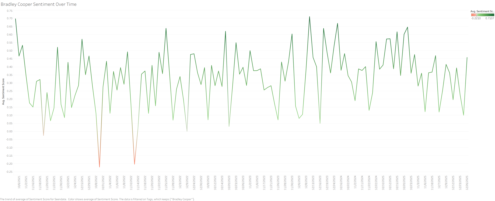

# Celebrity Likeability ETL

End-to-end pipeline to pull celebrity-related news from the GDELT API, scrape article text, clean and delete duplicates from the data, load it into PostgreSQL, and perform sentiment analysis using an ensemble of Hugging Face, VADER, and TextBlob. Tableau can then be used to visualize trends over time. 

## Project Structure
- [pipeline.py](pipeline.py): Orchestrates Extract -> Transform -> Load ([news extractor](Extract/news_extractor.py), [cleaner](Transform/transformer.py), [DB writer](Load/loader.py)).
- [Extract/news_extractor.py](Extract/news_extractor.py): Builds GDELT queries, fetches JSON, and scrapes article bodies.
- [Transform/transformer.py](Transform/transformer.py): Cleans text, fills missing fields, and drops duplicates.
- [Load/loader.py](Load/loader.py): Writes cleaned rows into PostgreSQL via SQLAlchemy.
- [sentiment_analysis.py](sentiment_analysis.py): Reads loaded rows, ensembles Hugging Face + VADER + TextBlob to produce sentiment scores and uploads them to a new table.

## Example Tableau Visualization

## References:
- GDELT API Reference: https://blog.gdeltproject.org/gdelt-doc-2-0-api-debuts/
- Hugging Face Sentiment Analysis: https://huggingface.co/tabularisai/multilingual-sentiment-analysis
